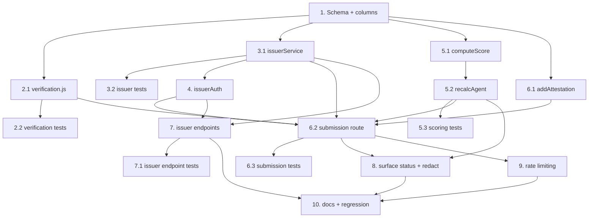

# Implementation Plan

## Overview

This plan implements verifiable (signed) attestations for Kairune. Work proceeds from the database schema outward: a verification module and issuer service are built on top of the schema, the trust score engine learns verification-weighting, and finally the attestation submission route and issuer REST endpoints are wired together, followed by response surfacing, rate-limit alignment, docs, and regression. All work uses Node's built-in `crypto` (Ed25519) and the existing `node:test` + in-memory DB setup — no new dependencies. Each task is test-backed and references the requirements and correctness properties it satisfies.

## Tasks

- [x] 1. Database schema: issuers, issuer_keys, and attestation columns
  - Add `issuers` and `issuer_keys` `CREATE TABLE IF NOT EXISTS` blocks to `src/db/schema.sql` (with the `idx_issuer_keys_issuer` index)
  - Add an idempotent column-add guard in `src/db/index.js` `initSchema` that inspects `PRAGMA table_info(attestations)` and runs `ALTER TABLE attestations ADD COLUMN` for `verification_status` (default `unverified`), `issuer_id`, `issuer_key_id` only when absent
  - Verify existing rows default to `unverified` and schema apply stays idempotent on re-run
  - _Requirements: 4.4, 2.1_
  - _Properties: 3_

- [x] 2. Verification module (canonical payload + Ed25519)
- [x] 2.1 Implement `src/services/verification.js`
  - `canonicalPayload(fields)` — deterministic sorted-key JSON over the fixed field set (agent_id, kind, amount, note, issuer_id, issuer_key_id, issued_at); normalize `amount` to number and empty `note` to null
  - `verifySignature({ publicKeyPem, canonical, signatureB64 })` using Node `crypto.createPublicKey` + `crypto.verify(null, ...)` for Ed25519
  - `evaluate({ fields, issuerKey })` → `{ status, reason }` (`unverified` when key is revoked)
  - _Requirements: 3.1, 3.8, 2.8_
  - _Properties: 1, 2_
- [x] 2.2 Unit tests for verification
  - Round-trip: generate Ed25519 keypair, sign canonical payload, assert verify true
  - Tamper: mutate any single field → verify false
  - Canonical determinism: identical field values in different key order → identical bytes
  - Revoked key path in `evaluate` → `unverified`
  - _Requirements: 3.8, 3.5, 2.8_
  - _Properties: 1, 2_

- [x] 3. Issuer service
- [x] 3.1 Implement `src/services/issuerService.js`
  - `createIssuer({ displayName })` — trim + validate 1–200 chars; generate API key via `crypto.randomBytes(24).toString('base64url')` (≥32 chars); store only `api_key_hash` (sha256); return `{ issuer, apiKey }` once
  - `listIssuers()` returning no secrets
  - `getIssuerByApiKey(apiKey)` with constant-time hash compare
  - `addKey(issuerId, { publicKeyPem, algo })` — reject unparseable / unsupported algo / encoded length > 4096 bytes; store SPKI PEM, status `active`
  - `revokeKey(issuerId, keyId)` — 404 when missing; idempotent when already revoked; set `revoked_at`
  - `getActiveKey(issuerId, keyId)`
  - _Requirements: 1.1, 1.2, 1.3, 1.4, 2.1, 2.3, 2.5, 2.6, 2.7_
  - _Properties: 9_
- [x] 3.2 Unit tests for issuer service
  - API key returned once; stored only as hash; `getIssuerByApiKey` resolves; list exposes no secret
  - Display name bounds (empty/whitespace/>200) rejected
  - Key registration rejects malformed/oversized keys; revoke missing → 404-style error; idempotent re-revoke
  - _Requirements: 1.1, 1.3, 1.4, 2.3, 2.6, 2.7_
  - _Properties: 9_

- [x] 4. Issuer auth middleware
  - Implement `src/middleware/issuerAuth.js` reading `X-Issuer-Key`, resolving via `getIssuerByApiKey`; attach `req.issuer`; 401 when absent/invalid
  - _Requirements: 2.2, 3.7_

- [x] 5. Verification-weighted trust scoring
- [x] 5.1 Extend `computeScore` in `src/services/trustScore.js`
  - Accept `opts.unverifiedFactor` (default `DEFAULT_UNVERIFIED_FACTOR = 0.25`); validate to [0,1] with fallback to 0.25 on invalid/non-numeric
  - Apply factor 1.0 to `verified`, `unverifiedFactor` to `unverified`, exclude any other status
  - Add `verifiedCount`, `unverifiedCount`, `excludedCount` to breakdown; empty input → baseline with zero counts
  - Keep function pure (deterministic)
  - _Requirements: 5.1, 5.2, 5.3, 5.4, 5.6, 5.7, 5.8_
  - _Properties: 4, 5, 6, 7_
- [x] 5.2 Update `recalcAgent` in `src/services/agentService.js`
  - Include `verification_status` in the attestation `SELECT` and pass `unverifiedFactor` from env (`UNVERIFIED_WEIGHT_FACTOR`) into `computeScore`
  - _Requirements: 5.2, 5.3_
- [x] 5.3 Unit tests for scoring
  - Verified vs unverified weighting (default 0.25); verified dominance; configurable factor; invalid factor falls back; count conservation; empty input baseline; determinism
  - _Requirements: 5.1, 5.2, 5.3, 5.4, 5.6, 5.7, 5.8_
  - _Properties: 4, 5, 6, 7_

- [x] 6. Attestation submission with verification
- [x] 6.1 Extend `attestationService.addAttestation`
  - Accept optional `{ verification_status, issuer_id, issuer_key_id }`; persist new columns; default `unverified`; still trigger `recalcAgent`
  - _Requirements: 3.2, 3.3, 4.1, 4.3, 4.4_
  - _Properties: 3_
- [x] 6.2 Rewire `POST /api/agents/:id/attestations` in `src/routes/api.js`
  - Detect presence of `issuer_id`/`issuer_key_id`/`signature`: none → record `unverified`; partial → 400; all present → resolve issuer via API key (401 mismatch), resolve key (400 if unknown issuer/key), verify signature (400 mismatch), record `verified` (or `unverified` if key revoked)
  - Preserve existing kind/agent validation for unsigned path; ensure no record + no rescore on any 4xx
  - _Requirements: 3.2, 3.3, 3.4, 3.5, 3.6, 3.7, 4.1, 4.2, 4.5, 4.6_
  - _Properties: 3, 8_
- [x] 6.3 Integration tests for submission
  - Signed → `verified` and score rises more than equivalent unsigned; unsigned → 201 `unverified`; signature mismatch → 400; unknown issuer/key → 400; partial creds → 400; wrong API key → 401; revoked key → `unverified`; assert no-write on each rejection
  - _Requirements: 3.2, 3.3, 3.4, 3.5, 3.6, 3.7, 4.1, 4.5, 4.6_
  - _Properties: 8_

- [x] 7. Issuer REST endpoints
  - `POST /api/issuers` (Admin via `requireAdmin`) → returns `api_key` once; `GET /api/issuers` (Admin) no secrets
  - `POST /api/issuers/:id/keys` and `DELETE /api/issuers/:id/keys/:kid` (issuerAuth); enforce ownership → 403 on cross-issuer
  - _Requirements: 1.1, 1.2, 1.5, 2.1, 2.5, 2.9_
  - _Properties: 9_
- [x] 7.1 Integration tests for issuer endpoints
  - Admin registers issuer (401 without Admin key when configured); key register/revoke; cross-issuer op → 403; list never exposes API key
  - _Requirements: 1.2, 1.5, 2.2, 2.9_
  - _Properties: 9_

- [x] 8. Surface verification status and redact secrets
  - Include `verification_status` in attestation records; add issuer id + display name for `verified`, omit for `unverified`; exclude signature/API key/private material from all responses
  - Add verified/unverified counts to the agent Trust_Card response and `/a/:handle` boot JSON in `server.js`
  - Expose `unverified_weight_factor` and supported algorithm in `GET /api/meta`
  - _Requirements: 6.1, 6.2, 6.3, 6.4, 6.5_
  - _Properties: 9_

- [x] 9. Rate limiting alignment
  - Ensure attestation submissions (signed and unsigned) pass through existing `rateLimit`; key by API key when present else IP; confirm 429 + Retry-After behavior unchanged
  - _Requirements: 7.1, 7.2, 7.3, 7.4_

- [x] 10. Docs and full regression
  - Update `README.md` (new endpoints, verification model, `UNVERIFIED_WEIGHT_FACTOR`, `.env.example`) and note the score shift for legacy unverified data
  - Run `npm test`; ensure all existing + new suites pass
  - _Requirements: 4.2, 5.3_

## Notes

- No new npm dependency: Ed25519 signing/verification uses Node's built-in `crypto`.
- Because `CREATE TABLE IF NOT EXISTS` cannot add columns to an existing `attestations` table, Task 1 uses a `PRAGMA table_info` guard + `ALTER TABLE ADD COLUMN` to stay idempotent.
- Introducing verification will lower scores for agents whose history is entirely unverified (unverified weight defaults to 0.25). This is intended; call it out in the README/changelog.
- Open questions from the design (Ed25519 as sole algorithm, 0.25 default factor, API-key-only key management, replay-protection window) should be confirmed before/while implementing Tasks 5 and 6.

## Task Dependency Graph

```json
{
  "waves": [
    { "wave": 1, "tasks": ["1"] },
    { "wave": 2, "tasks": ["2.1", "3.1", "5.1"] },
    { "wave": 3, "tasks": ["2.2", "3.2", "4", "5.2", "6.1"] },
    { "wave": 4, "tasks": ["5.3", "6.2", "7"] },
    { "wave": 5, "tasks": ["6.3", "7.1", "8", "9"] },
    { "wave": 6, "tasks": ["10"] }
  ]
}
```


